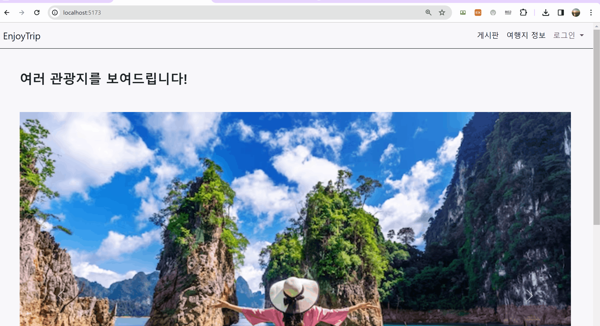
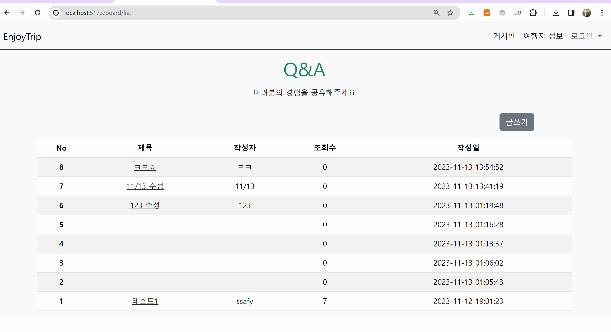
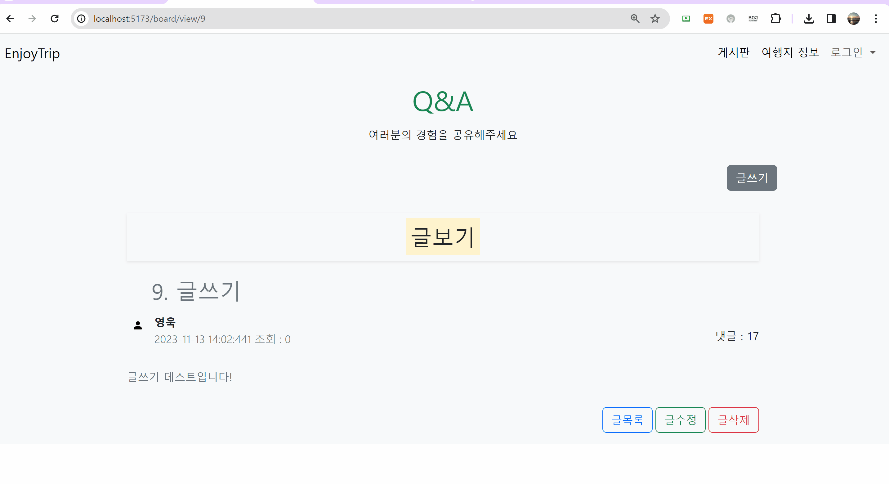
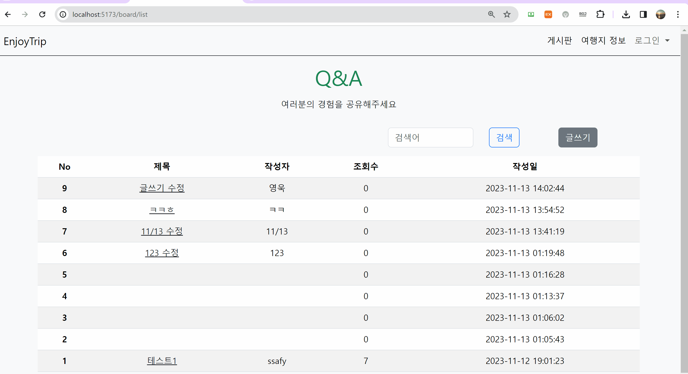

관통 프로젝트 제출 방법

# 관통프로젝트: TP*S10_S09_Vue_EnjoyTRip*김제영\_김영욱

### 제출일: 2024.11.10

### 참여 페어

- 김제영(조장), 김영욱

### 처리된 요구사항 목록

| 난이도 | 구현기능                               | 세부             | 작성여부(O/X) |
| :----: | -------------------------------------- | ---------------- | :-----------: |
|  기본  | QnA 게시판 Vue.js를 적용한 웹페이지    | 게시글 목록      |       O       |
|  기본  | QnA 게시판 Vue.js를 적용한 웹페이지    | 게시글 등록      |       O       |
|  기본  | QnA 게시판 Vue.js를 적용한 웹페이지    | 게시글 수정      |       O       |
|  기본  | QnA 게시판 Vue.js를 적용한 웹페이지    | 게시글 상세 검색 |       O       |
|  기본  | 서버측 구현                            | 게시글 목록      |       O       |
|  기본  | 서버측 구현                            | 게시글 등록      |       O       |
|  기본  | 서버측 구현                            | 게시글 수정      |       O       |
|  기본  | 서버측 구현                            | 게시글 삭제      |       O       |
|  기본  | 서버측 구현                            | 게시글 상세 검색 |       O       |
|  추가  | 나마의 여행계획 페이지(팀별 아이디어)  |                  |       X       |
|  추가  | 나만의 여행 계획 페이지(팀별 아이디어) |                  |       X       |
|  심화  | HtoPLace 관련 페이지(팀별 아이디어)    |                  |       X       |

- ERD 캡쳐는 README에서 확인할 수 있도록 첨부합니다.
- DDL sql 파일은 프로젝트 루트에 sql 폴더를 생성 후 그 안에 ddl.sql 이라고 저장합니다.

* DDL을 만들 때는 database를 export 해서 생성하세요.

* 작성된 기능은 반드시 캡쳐되어야 합니다. 
* 추가로 구현한 기능을 표에 추가시키세요.

### 실행화면 캡쳐 -

###TODO: QnA 게시판 목록

###TODO: QnA 게시판 등록, 상세 보기기

###TODO: QnA 게시판 수정

###TODO: QnA 게시판 검색

